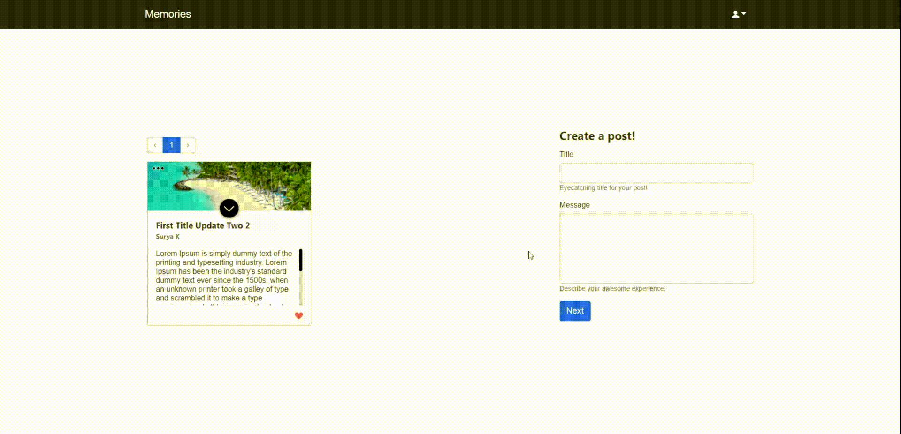

 
  

<!-- PROJECT LOGO -->

<br />

<p align="center">
  
  

</p>

 &nbsp;&nbsp;&nbsp;&nbsp;&nbsp;&nbsp;&nbsp;&nbsp;&nbsp;&nbsp;&nbsp;&nbsp;&nbsp;&nbsp;&nbsp;&nbsp;&nbsp;&nbsp;&nbsp;&nbsp;&nbsp;&nbsp;&nbsp;&nbsp;&nbsp;&nbsp;&nbsp;&nbsp;&nbsp;&nbsp;&nbsp;&nbsp;&nbsp;&nbsp;&nbsp;&nbsp;&nbsp;&nbsp;&nbsp;&nbsp;&nbsp;&nbsp;&nbsp;&nbsp;&nbsp;&nbsp;&nbsp;&nbsp;&nbsp;&nbsp;&nbsp;&nbsp;&nbsp;&nbsp;&nbsp;&nbsp;&nbsp;&nbsp;&nbsp;

[](https://opensource.org/licenses/MIT)

  <h3 align="center">Memories Mern</h3>

  <p align="center">
     An example CRUD app made using MERN stack. 
    <br />
    <br />
    <a href="https://memories-mern-new.herokuapp.com/">View Website</a>
  </p>


<!-- TABLE OF CONTENTS -->
<details open="open">
  <summary>Table of Contents</summary>
  <ol>
        <li><a href="#built-with">Built With</a></li>
      </ul>
    </li>
    <li><a href="#installation">Installation</a></li></li>
      </ul>
    </li>
    <li><a href="#usage">Usage</a></li>
    <li><a href="#contact">Contact</a></li>
  </ol>
</details>


<!-- ABOUT THE PROJECT -->
## About The Project


### Built With

* [ReactJS](https://reactjs.org/)
* [Mongo DB ](https://www.mongodb.com/)
* [Express JS ](https://expressjs.com/)
* [Node JS](https://nodejs.org/en/)


### Installation
   ```sh
   git clone https://github.com/suryakanigolla/memories-mern.git .
   npm run build
   npm run start
   ```


<!-- USAGE EXAMPLES -->
## Usage

<figure>
    
</figure>

- Create a Post
- Update a Post
- Like a Post
- Delete a Post
- Tag your images when creating a post with markers


<!-- CONTACT -->
## Contact

[![LinkedIn][linkedin-shield]][linkedin-url]


[linkedin-shield]: https://img.shields.io/badge/-LinkedIn-black.svg?style=for-the-badge&logo=linkedin&colorB=555
[linkedin-url]: https://www.linkedin.com/in/suryakanigolla/
